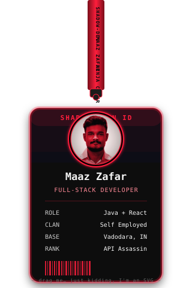

<picture>
  <source media="(prefers-color-scheme: dark)" srcset="banner.svg">
  <source media="(prefers-color-scheme: light)" srcset="banner-light.svg">
  
</picture>

 

 

## 🗡️ About the Shadow

I'm an **ASE at Hexaview Technologies**, moving quietly through codebases and leaving clean, scalable, maintainable systems behind — built with **React, JavaScript, Node.js, and Express**. I don't break builds at 2 AM; I strike once, and it works.

- 🥷 Full-stack dev — from reusable components to secure, well-guarded APIs
- ⚔️ Obsessed with clean UI, fast performance, and code the *next* dev (future-me included) can actually read
- 🌑 Messy code doesn't scare me — "let's refactor this properly" is basically my battle cry
- 📍 Based in Noida, Uttar Pradesh

 

## 🎴 ID Badge

 

## ⚔️ Arsenal (Tech Stack)

        

        

     

     

  

 

## 📊 Shadow Stats & Graphs

 

## 🏆 Trophy Wall

 

## 🐍 Contribution Snake

<picture>
  <source media="(prefers-color-scheme: dark)" srcset="https://raw.githubusercontent.com/maazzafar1234/maazzafar1234/output/snake-dark.svg">
  <source media="(prefers-color-scheme: light)" srcset="https://raw.githubusercontent.com/maazzafar1234/maazzafar1234/output/snake-light.svg">
  
</picture>

 

## 🔗 Send a Signal

"Code silently. Ship without a trace." 🥷

